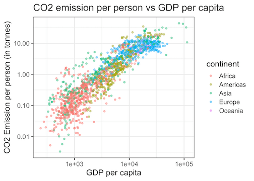
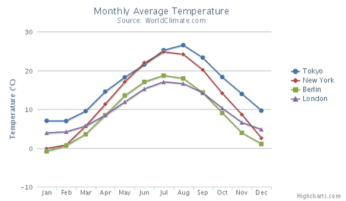
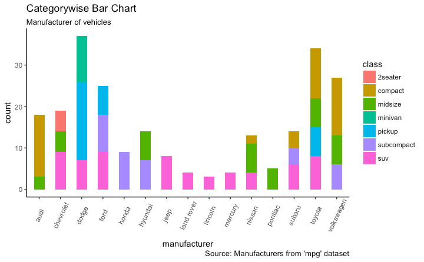
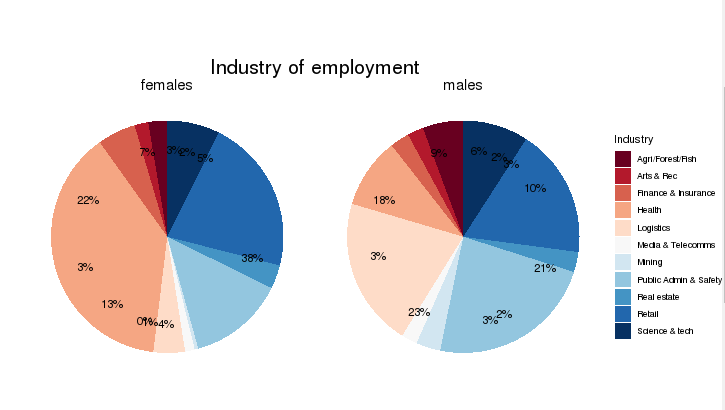
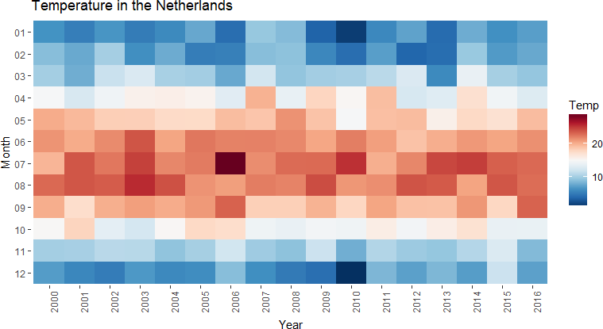

```{r setup, include=FALSE}
knitr::opts_chunk$set(echo = TRUE)
```

## Agenda for the workshop

- Creating different types of data visualizations with ggplot2
- When to use a certain type of visualzation
- Creating word clouds for text data using tm and wordcloud

# ggplot

## What is ggplot?

ggplot2 is a data visualization package for R. You provide the data, tell ggplot2 how to map variables to aesthetics, what graphical primitives to use, and it takes care of the details.

## How to install  and load ggplot2
To install:

```{r, eval=FALSE}
install.packages("ggplot2")
```

To load: 
```{r, message = F, warning =F}
library(ggplot2)
```

## Loading our dataset

We'll use a dataset called diamonds. This is a smaller version of the original diamonds dataset. We will load the file as follows:

```{r, eval=T}
diamonds <- read.csv("diamonds.csv")
```

## Dataset Background {.smaller}

- price: price in US dollars (\$326--\$18,823)

- carat: weight of the diamond (0.2--5.01)

- cut: quality of the cut (Fair, Good, Very Good, Premium, Ideal)

- color: diamond colour, from J (worst) to D (best)

- clarity: a measurement of how clear the diamond is (I1 (worst), SI2, SI1, VS2, VS1, VVS2, VVS1, IF (best))

- x: length in mm (0--10.74)

- y: width in mm (0--58.9)

- z: depth in mm (0--31.8)

- depth: total depth percentage = z / mean(x, y) = 2 * z / (x + y) (43--79)

- table: width of top of diamond relative to widest point (43--95)

## Checking out our Data

```{r}
head(diamonds)
```


## Creating our first visualization 

Let's say we want to plot the carat column on the x axis and price on the y axis

```{r,fig.width=7,fig.height=4}
ggplot(data = diamonds, mapping = aes(x = carat, y = price))
```

## Let's try again with geoms

```{r}
ggplot(data = diamonds, mapping = aes(x = carat, y = price)) + 
  geom_point()
```

## Adding a trend line

```{r, message=F}
ggplot(data = diamonds, mapping = aes(x = carat, y = price)) + 
  geom_point()+geom_smooth()
```


## When to use Scatteplots

- X: Numerical, Y: Numerical
- Works best with continuous variables.
- Used to check for association (correlation) between two variables.


- Doesn't work well with large datasets. Points start to look like blobs.


## A Good Scatterplot



Source: https://cmdlinetips.com/2019/11/9-tips-to-make-better-scatter-plots-with-ggplot2-in-r/

## Creating Line Graphs

```{r}
ggplot(data = diamonds, mapping = aes(x = carat, y = price)) + 
  geom_point()+
  geom_line()
```

## When to use Line Graphs

- X: Time, Y: Numerical
- When your data is chronological (time on X-axis, variable on Y-axis)

## A Good Line Graph



Source: https://www.r-bloggers.com/2019/04/a-detailed-guide-to-plotting-line-graphs-in-r-using-ggplot-geom_line/)

## Creating Bubble Charts

```{r}
ggplot(data = diamonds, mapping = aes(x = x, y = y, size = price)) + 
  geom_point(alpha = 0.3)
```

## When to use Bubble Charts

- X: Numerical, Y: Numerica, Size: Numerical
- When you want to represent a third variable that somehow indicates the significance of every point
- Often used for financial data

## A Good Bubble Chart


Source: https://www.r-bloggers.com/2019/04/a-detailed-guide-to-the-ggplot-scatter-plot-in-r/

## Creating Barplots
```{r}
ggplot(data = diamonds, mapping = aes(x = color)) +
  geom_bar(fill = "darkblue")
```

## When to use Barplots

- X: Categorical, Y: Count
- Used mainly to summarize the counts of obervations per category
- Also used for chronological data (X: Time, Y: Numeric variable)

## A Good Barplot



Source: http://r-statistics.co/Top50-Ggplot2-Visualizations-MasterList-R-Code.html

## Creating Pie Charts

```{r}
ggplot(diamonds, aes(x=factor(1), fill=color))+
  geom_bar(width = 1)+
  coord_polar("y")
```

## Let's make it a little cleaner

```{r, eval=F}
ggplot(diamonds, aes(x=factor(1), fill=color))+
  geom_bar(width = 1)+
  coord_polar("y")+
  theme(
  axis.title.x = element_blank(),
  axis.title.y = element_blank(),
  panel.grid=element_blank(),
  axis.ticks = element_blank(),
  axis.text.y=element_blank()
  )+
  scale_fill_brewer("Blues")  +
  theme(axis.text.x=element_blank())
```

## Final Pie Chart


```{r, echo=F}
ggplot(diamonds, aes(x=factor(1), fill=color))+
  geom_bar(width = 1)+
  coord_polar("y")+
  theme(
  axis.title.x = element_blank(),
  axis.title.y = element_blank(),
  panel.grid=element_blank(),
  axis.ticks = element_blank(),
  axis.text.y=element_blank()
  )+
  scale_fill_brewer("Blues")  +
  theme(axis.text.x=element_blank())
```

## When to use Pie Charts

- Categorical variable
- Best to use when you are trying to compare parts of a whole

## A Good Pie Chart



Source: https://stackoverflow.com/questions/54935857/best-way-to-label-pie-charts-ggplot2-which-respond-to-user-input-in-r-shiny

## Creating Heatmaps

Let's suppose we want to plot the mean price for each combination of color and cut as a heatmap. Let's create a dataframe to reflect that data.

```{r, message=F, warning=F}
library(dplyr)
hm.df <- diamonds %>% group_by(color, cut) %>% 
  summarize(mean_price = mean(price))
head(hm.df)
```

##

Now, let's plot it 

```{r, eval= F}
ggplot(hm.df, aes(x = color,y = cut, fill = mean_price)) +
  geom_tile()+
  scale_fill_continuous(high = "#132B43", low = "#56B1F7")
```

## Final Heatmap

```{r, echo= F}
ggplot(data = hm.df, mapping = aes(x = color,y = cut, fill = mean_price)) +
  geom_tile()+
  scale_fill_continuous(high = "#132B43", low = "#56B1F7")
```

## When to use Heatmaps

- X: Categorical, Y: Categorical, Color: Numeric Aggregate/Summary data
- Used to show the variation of some variable across combinations of two categorical variables
- By observing how cell colors change across each axis, you can observe if there are any patterns in value for one or both variables.

## A Good Heat Map



Source: https://www.worldfullofdata.com/three-ways-create-heatmap-r/

## Saving a ggplot visualization

You can use ggsave to save the last ggplot created, like this:

```{r, eval = F}
ggplot(data = diamonds, mapping = aes(x = color, fill = color)) +
  geom_bar()
ggsave(filename = "Barplot.png")
```


## ggplot resources

- All the geoms you can use: https://ggplot2.tidyverse.org/reference/#section-geoms

- In-depth tutorial with information about customization of graphs, axes, labels, legends, etc.: http://r-statistics.co/ggplot2-Tutorial-With-R.html

# Word Clouds

## Work Clouds

Word cloud (or tag cloud) is a text mining method to find the most frequently used words in a text. It's a great way to summarize text data.

The text mining package (tm) and the word cloud generator package (wordcloud) are available in R for helping us to analyze texts and to quickly visualize the keywords as a word cloud.

Let's load the required libraries

```{r, message=F, warning = F}
library("tm") # for text mining
library("SnowballC") # for text stemming
library("wordcloud") # word-cloud generator 
library("RColorBrewer") # color palettes
```

## Reading in the text file and loading it as a corpus

```{r}
# Read the text file from internet
filePath <- "http://www.sthda.com/sthda/RDoc/example-files/
martin-luther-king-i-have-a-dream-speech.txt"
text <- readLines(filePath)
```

```{r}
# Load the data as a corpus
docs <- Corpus(VectorSource(text))
```

## Text transformation
Transformation is performed using tm_map() function to replace, for example, special characters from the text.

Replacing “/”, “@” and “|” with space:
```{r, message=F, warning = F}
toSpace <- content_transformer(function (x , pattern )
  gsub(pattern, " ", x))
docs <- tm_map(docs, toSpace, "/")
docs <- tm_map(docs, toSpace, "@")
docs <- tm_map(docs, toSpace, "\\|")
```

## Cleaning the text
The tm_map() function is used to remove unnecessary white space, to convert the text to lower case, to remove common stopwords like ‘the’, “we”. You could also remove numbers and punctuation with removeNumbers and removePunctuation arguments.

Another important preprocessing step is to make a text stemming which reduces words to their root form.

## Cleaning the text
```{r, warning = F, message = F}
# Convert the text to lower case
docs <- tm_map(docs, content_transformer(tolower))
# Remove numbers
docs <- tm_map(docs, removeNumbers)
# Remove english common stopwords
docs <- tm_map(docs, removeWords, stopwords("english"))
# Remove your own stop word
# specify your stopwords as a character vector
docs <- tm_map(docs, removeWords, c("blabla1", "blabla2")) 
# Remove punctuations
docs <- tm_map(docs, removePunctuation)
# Eliminate extra white spaces
docs <- tm_map(docs, stripWhitespace)
# Text stemming
docs <- tm_map(docs, stemDocument)
```

## Building a term document matrix

Document matrix is a table containing the frequency of the words. The function TermDocumentMatrix() from text mining package can be used as follows:

```{r}
dtm <- TermDocumentMatrix(docs)
m <- as.matrix(dtm)
v <- sort(rowSums(m),decreasing=TRUE)
d <- data.frame(word = names(v),freq=v)
head(d, 5)
```

## Generate the word Cloud

```{r}
wordcloud(words = d$word, freq = d$freq, min.freq = 1,
          max.words=200, random.order=FALSE, rot.per=0.35, 
          colors=brewer.pal(8, "Dark2"))
```

# Thank you